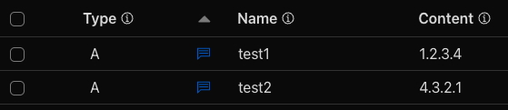

## 🧭 Before we begin

This post is part one of a two-part series. In this one, I'll show how to use YAML configurations in OpenTofu through a simple example. The second part will cover how to define and validate a YAML schema.

Part two can be found at [OpenTofu YAML Schema Validation](/posts/3/).

### Prerequisites

- [OpenTofu](https://opentofu.org/docs/intro/install/) installed
- A [Cloudflare](https://www.cloudflare.com/) account with an existing DNS zone

## 🎯 Objective

We'll see how to use `.yaml` files instead of `locals` or `variable` definitions with `.tfvars` files to allow YAML-based, Git-tracked configuration. I've found this useful when working with modules that deploy lots of similar `resource` definitions with different values for their parameters (e.g., DNS records).

The sample shows how to create [Cloudflare](https://www.cloudflare.com/) based DNS records.

### Benefits

The main benefits I've seen from this approach:

- YAML is well-known, easy to read and write
- Works well with automation toolchains
- Adds an abstraction layer and enables users to _just write YAML_

### Drawbacks

However, without YAML schema validation (which is covered in part two), there are some downsides to consider:

- No defaults (unlike `variable` definitions with `.tfvars` files)
- No quality or sanity checks for the provided input

## 🛠️ Using YAML in OpenTofu

To use `.yaml` files as configuration, we'll rely on the built-in functions [`file`](https://opentofu.org/docs/language/functions/file/) and [`yamldecode`](https://opentofu.org/docs/language/functions/yamldecode/).

---

The following folder structure is used:

```plaintext
.
├── configuration
│   └── dns_records.yaml
├── locals.tf
├── main.tf
├── providers.tf
├── terraform.tf
└── variables.tf
```

---

In `locals.tf`, we add simple logic:

```terraform
locals {
  yaml_path     = "${path.root}/configuration"
  yaml_filename = "dns_records.yaml"
  yaml_data     = yamldecode(file("${local.yaml_path}/${local.yaml_filename}"))
}
```

After adding this, `local.yaml_data` will contain the imported and decoded YAML content from the `configuration/dns_records.yaml` file. We can explore this using `opentofu console` together with the interactive function [`type`](https://opentofu.org/docs/language/functions/type/):

```bash
> opentofu console
> type(local.yaml_data)
object({
    dns_records: tuple([
        object({
            content: string,
            name: string,
            type: string,
        }),
        object({
            content: string,
            name: string,
            type: string,
        }),
    ]),
})
```

---

In `main.tf`, we add the following:

```terraform
locals {
  dns_records_from_yaml = { for i, o in local.yaml_data.dns_records : o.name => o }
}

# https://registry.terraform.io/providers/cloudflare/cloudflare/latest/docs/resources/dns_record
resource "cloudflare_dns_record" "this" {
  for_each = local.dns_records_from_yaml

  zone_id = var.zone_id

  name    = each.value.name
  type    = each.value.type
  content = each.value.content

  ttl     = 1
  comment = "Managed by OpenTofu"
}
```

First, we transform the list from `local.yaml_data.dns_records` into an object that can be used with `for_each`. To give each item a key (`for_each` identifier), we use its `name` field. In this case, the DNS record name becomes the key.

Here's how that looks:

```bash
> opentofu console
> type(local.dns_records_from_yaml)
object({
    test1.pmaier.at: object({
        content: string,
        name: string,
        type: string,
    }),
    test2.pmaier.at: object({
        content: string,
        name: string,
        type: string,
    }),
})
```

---

The sample DNS records added to the `configuration/dns_records.yaml` file:

```yaml
dns_records:
  - name: test1.pmaier.at
    type: A
    content: "1.2.3.4"
  - name: test2.pmaier.at
    type: A
    content: "4.3.2.1"
```

---

When running `opentofu apply`, this will result in the creation of two DNS records in Cloudflare:



PS: You can query the records using `nslookup` or `dig` - they exist.

---

Other required files (`providers.tf`, `terraform.tf`, `variables.tf`) can be found in the Blog-Resources Git Repository linked in the References.

## 🔚 Closing

Thanks so much for stopping by! I hope to see you back for part two, where we dive into schema creation and validation using OpenTofu.

## 📚 References

- [GitHub Code Samples (Blog-Resources)](https://github.com/philmph/Blog-Resources/tree/main/posts/20250512_opentofu-3-yaml)
- [Part Two (OpenTofu YAML Schema Validation)](/posts/3/)
